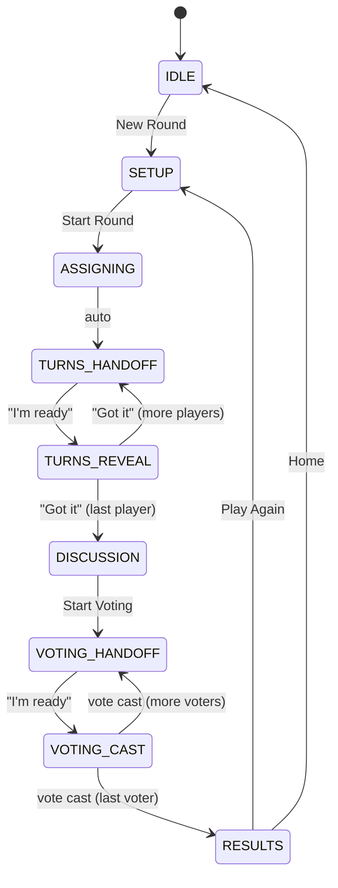

# Imposter Party Game — Architecture Document

> **Version**: 1.0  
> **Date**: 2026-06-13  
> **Status**: Draft  
> **Scope**: Local pass-and-play party game, single device, localhost only

---

## 1. Tech Stack

| Layer | Choice | Reasoning |
|-------|--------|-----------|
| Framework | **Next.js 14+ (App Router)** | User has Next.js experience. App Router gives file-based routing, server components, and API routes in one package. Fastest path to a working app. |
| Language | **TypeScript** | Type safety for the state machine and game logic. |
| Styling | **Tailwind CSS** | Rapid UI development, no CSS file management. |
| Persistence | **localStorage (via a thin abstraction)** | No server DB needed — local-only, single device. localStorage survives browser refreshes. A thin wrapper keeps the door open for IndexedDB if data grows. |
| State Management | **React Context + useReducer** | The game state machine maps naturally to a reducer. No external library needed for this scale. |
| Runtime | **Node.js (local `next dev`)** | Standard Next.js local development server. |

**Why NOT a backend DB?** The requirements state local-only, no auth, no deployment. All data lives on one device in one browser. localStorage (≈5-10 MB) is more than sufficient. API routes are unnecessary — all logic runs client-side.

**Architecture style**: This is a **client-only SPA** using Next.js purely for routing, tooling, and DX. No API routes. No server state. All game logic and persistence live in the browser.

---

## 2. Data Model / Schema

All entities are stored as JSON in localStorage under namespaced keys.

### 2.1 `items` — Word Pool

```
Key: "imposter:items"

Schema: Item[]

Item {
  id: string          // nanoid, e.g. "V1StGXR8_Z5jdHi6B-myT"
  text: string        // the word or short phrase, trimmed, case-preserved
  createdAt: string   // ISO 8601 timestamp
}
```

- **Uniqueness constraint**: `text` must be unique (case-insensitive comparison on insert).
- No soft-delete; removal is permanent.

### 2.2 `players` — Player Registry

```
Key: "imposter:players"

Schema: Player[]

Player {
  id: string          // nanoid
  name: string        // display name, trimmed
  createdAt: string   // ISO 8601
}
```

- **Uniqueness constraint**: `name` must be unique (case-insensitive).
- Players are never deleted, only added. This enables "select from previous players."

### 2.3 `rounds` — Round History

```
Key: "imposter:rounds"

Schema: Round[]

Round {
  id: string                   // nanoid
  roundNumber: number          // sequential, 1-based
  playerIds: string[]          // ordered list of player IDs in this round
  imposterIds: string[]        // player IDs who were imposters
  actualItemId: string         // the real word's item ID
  decoyItemId: string          // the decoy word's item ID shown to imposters
  votes: Vote[]                // one per player
  result: "crewmates" | "imposters"  // who won
  completedAt: string          // ISO 8601
}

Vote {
  voterId: string              // player ID who cast the vote
  suspectId: string            // player ID they voted for
}
```

### 2.4 `usedItemIds` — Exclusion Tracking

```
Key: "imposter:usedItemIds"

Schema: string[]    // array of item IDs that have been used as the actual word
```

- Only the **actual** word is marked as used, not the decoy.
- When all items are exhausted, the app warns the user and offers to reset the used list.

### 2.5 `scores` — Cumulative Scores

```
Key: "imposter:scores"

Schema: Record<string, PlayerScore>   // keyed by player ID

PlayerScore {
  playerId: string
  totalRounds: number
  roundsAsCrewmate: number
  roundsAsImposter: number
  correctVotes: number         // times they voted for an actual imposter
  timesIdentified: number      // times they were correctly identified (as imposter)
  timesEvaded: number          // times they were imposter and NOT identified
  wins: number                 // see scoring rules §7.4
}
```

### 2.6 `gameSession` — In-Progress Game State

```
Key: "imposter:gameSession"

Schema: GameSession | null

GameSession {
  status: GameStatus           // see state machine §6
  playerIds: string[]          // players in this round
  imposterCount: number        // configured number of imposters
  imposterIds: string[]        // assigned imposters (set after setup)
  actualItemId: string | null  // the real word
  decoyItemId: string | null   // the decoy word
  currentTurnIndex: number     // index into playerIds, tracks who is viewing
  revealedPlayers: string[]    // player IDs who have already seen their word
  votes: Vote[]                // accumulated votes
}
```

This is the **live** game state. It is written to localStorage on every transition so the game survives a page refresh mid-round.

### Entity Relationship Summary

```
Player ──< Round (via playerIds, imposterIds)
Item   ──< Round (via actualItemId, decoyItemId)
Player ──< Vote (via voterId, suspectId)
Round  ──< Vote (embedded)
Player ──< PlayerScore (1:1 by playerId)
```

---

## 3. App Screens / Pages

### 3.1 Screen Inventory

| # | Route | Screen Name | Purpose |
|---|-------|-------------|---------|
| 1 | `/` | Home | Entry point. Start new round or go to admin. |
| 2 | `/admin/items` | Item Manager | Add/remove words from the pool. View used items. |
| 3 | `/admin/history` | Game History | View past rounds, scores, leaderboard. |
| 4 | `/play/setup` | Round Setup | Add/select players, configure imposter count. |
| 5 | `/play/turn` | Turn Screen | Pass-and-play: shows current player name, tap to reveal word, confirm done. |
| 6 | `/play/discuss` | Discussion | Timer-optional screen. "Discussion phase — talk it out!" |
| 7 | `/play/vote` | Voting | Each player takes the device and votes for who they think is the imposter. |
| 8 | `/play/results` | Results | Reveal imposter(s), vote tally, who won, score changes. |

### 3.2 Screen Flow

```
HOME
 ├─> ITEM MANAGER ─> HOME
 ├─> GAME HISTORY ─> HOME
 └─> ROUND SETUP
      └─> TURN SCREEN (loops per player)
           └─> DISCUSSION
                └─> VOTING (loops per player)
                     └─> RESULTS
                          ├─> ROUND SETUP (play again)
                          └─> HOME
```

### 3.3 Screen Details

**Home (`/`)**
- "New Round" button (disabled if < 3 items in pool or < 3 players possible)
- "Manage Items" link
- "Game History" link
- Shows quick stats: total rounds played, available items remaining

**Item Manager (`/admin/items`)**
- Text input + "Add" button
- List of all items with delete button
- Visual indicator for used items (greyed out / strikethrough)
- "Reset Used Items" button (clears usedItemIds)
- Count: "X available / Y total"

**Round Setup (`/play/setup`)**
- "Add New Player" text input
- List of all known players with checkboxes to select for this round
- Imposter count selector: 1 to floor((selectedPlayers - 1) / 2), default 1
- Minimum player validation: at least (imposterCount + 2) players required
- "Start Round" button
- Warning if available (unused) items are low

**Turn Screen (`/play/turn`)**
- **Phase A — Hand-off**: Shows "Pass the device to: **{PlayerName}**" with large text. "I'm ready" button.
- **Phase B — Reveal**: On tap/click, shows the word. Real players see the actual word. Imposters see the decoy. No visual distinction — both see "Your word is: **{word}**". "Got it" button.
- **Phase C — Concealed**: Returns to Phase A for the next player, or transitions to Discussion after last player.
- Player order is the order from setup (no shuffling needed — the imposter assignment is random, not the order).

**Discussion (`/play/discuss`)**
- Large text: "Discuss! Who is the imposter?"
- Optional: simple visible timer (not enforced, just visual aid)
- "Start Voting" button

**Voting (`/play/vote`)**
- Same pass-and-play pattern as Turn Screen
- **Phase A**: "Pass the device to: **{PlayerName}**"
- **Phase B**: Shows list of all OTHER players. Player taps to vote. Confirm button.
- After last voter, transitions to Results.

**Results (`/play/results`)**
- Reveal: "The imposter was: **{Name(s)}**!"
- The actual word and the decoy word
- Vote breakdown: who voted for whom
- Outcome: "Crewmates win!" or "Imposter(s) win!"
- Score changes for this round
- "Play Again" button (goes to Round Setup) and "Home" button

---

## 4. API Routes

**None.** All logic is client-side. No API routes are needed.

The data layer is a set of pure TypeScript functions that read/write localStorage. This keeps the architecture simple and avoids unnecessary network round-trips on a local-only app.

---

## 5. Component Hierarchy

```
RootLayout
├── GameProvider (Context: game state, dispatch)
│   └── PersistenceSync (reads/writes localStorage on state change)
│
├── HomePage
│   ├── QuickStats
│   ├── NavButton ("New Round")
│   ├── NavButton ("Manage Items")
│   └── NavButton ("Game History")
│
├── ItemManagerPage
│   ├── AddItemForm
│   │   └── TextInput + SubmitButton
│   ├── ItemList
│   │   └── ItemRow[] (text, used badge, delete button)
│   └── ResetUsedButton
│
├── GameHistoryPage
│   ├── Leaderboard
│   │   └── PlayerScoreRow[]
│   └── RoundHistoryList
│       └── RoundCard[] (round #, players, word, result)
│
├── RoundSetupPage
│   ├── AddPlayerForm
│   ├── PlayerSelector
│   │   └── PlayerCheckbox[]
│   ├── ImposterCountSelector
│   └── StartRoundButton
│
├── TurnPage
│   ├── HandoffScreen (player name, "I'm ready")
│   └── RevealScreen (word display, "Got it")
│
├── DiscussionPage
│   ├── DiscussionPrompt
│   ├── Timer (optional, visual-only)
│   └── StartVotingButton
│
├── VotingPage
│   ├── VoterHandoff (player name)
│   └── VoteBallot
│       └── VoteOption[] (other player names)
│
└── ResultsPage
    ├── ImposterReveal
    ├── WordReveal (actual + decoy)
    ├── VoteBreakdown
    │   └── VoteRow[]
    ├── OutcomeBanner
    ├── ScoreChanges
    └── ActionButtons ("Play Again", "Home")
```

### Shared / Utility Components

```
ConfirmDialog         — used for destructive actions (delete item, reset used items)
PlayerBadge           — displays a player name with consistent styling
WordDisplay           — large-text word reveal with tap-to-show behavior
PassDeviceScreen      — reusable hand-off screen pattern (used in turns + voting)
```

---

## 6. Game State Machine

### 6.1 States (GameStatus enum)

```
IDLE              — no active game session
SETUP             — players being selected, imposter count configured
ASSIGNING         — system assigns imposters, picks words (transient, auto-advances)
TURNS_HANDOFF     — waiting for next player to take the device
TURNS_REVEAL      — player is viewing their word
DISCUSSION        — all players have seen words, discussion in progress
VOTING_HANDOFF    — waiting for next voter to take the device
VOTING_CAST       — voter is choosing a suspect
RESULTS           — round complete, results displayed
```

### 6.2 Transitions

```
IDLE
  ──[user clicks "New Round"]──> SETUP

SETUP
  ──[user clicks "Start Round" with valid config]──> ASSIGNING

ASSIGNING
  ──[system picks imposters, actual word, decoy word; auto-advance]──> TURNS_HANDOFF

TURNS_HANDOFF
  ──[player taps "I'm ready"]──> TURNS_REVEAL

TURNS_REVEAL
  ──[player taps "Got it", more players remain]──> TURNS_HANDOFF
  ──[player taps "Got it", all players done]──> DISCUSSION

DISCUSSION
  ──[user taps "Start Voting"]──> VOTING_HANDOFF

VOTING_HANDOFF
  ──[voter taps "I'm ready"]──> VOTING_CAST

VOTING_CAST
  ──[voter submits vote, more voters remain]──> VOTING_HANDOFF
  ──[voter submits vote, all voters done]──> RESULTS

RESULTS
  ──[user taps "Play Again"]──> SETUP
  ──[user taps "Home"]──> IDLE
```

### 6.3 State Machine Diagram (Mermaid)



### 6.4 Refresh Resilience

The entire `GameSession` object is persisted to localStorage on **every state transition**. On app load:
1. Read `imposter:gameSession` from localStorage.
2. If non-null, restore the game to the persisted state and route the user to the corresponding screen.
3. If null, route to Home.

---

## 7. Key Algorithms

### 7.1 Random Item Selection (with Exclusion)

```
Input:  allItems: Item[], usedItemIds: string[]
Output: selectedItem: Item
Throws: InsufficientItemsError if no available items

1. availableItems = allItems.filter(item => !usedItemIds.includes(item.id))
2. If availableItems.length === 0, throw InsufficientItemsError
3. selectedItem = availableItems[randomInt(0, availableItems.length - 1)]
4. Add selectedItem.id to usedItemIds (persisted)
5. Return selectedItem
```

Use `crypto.getRandomValues()` for randomness (available in all modern browsers, cryptographically secure, avoids `Math.random()` bias).

### 7.2 Decoy Word Selection

```
Input:  allItems: Item[], actualItemId: string
Output: decoyItem: Item
Throws: InsufficientItemsError if only 1 item exists

1. candidates = allItems.filter(item => item.id !== actualItemId)
2. If candidates.length === 0, throw InsufficientItemsError
3. decoyItem = candidates[randomInt(0, candidates.length - 1)]
4. Return decoyItem
```

**Note**: The decoy is picked from ALL items (including used ones), because it's not being "used" as the round's actual word. Only the actual word is excluded from future rounds.

### 7.3 Imposter Assignment

```
Input:  playerIds: string[], imposterCount: number
Output: imposterIds: string[]

1. Validate: imposterCount >= 1 AND imposterCount <= floor((playerIds.length - 1) / 2)
2. Shuffle a copy of playerIds using Fisher-Yates shuffle
3. imposterIds = shuffledCopy.slice(0, imposterCount)
4. Return imposterIds
```

### 7.4 Voting & Outcome Logic

```
Input:  votes: Vote[], imposterIds: string[], playerIds: string[]
Output: result: "crewmates" | "imposters"

1. Build voteTally: Record<suspectId, count>
   - For each vote, increment tally for vote.suspectId
2. Find maxVotes = max(Object.values(voteTally))
3. topSuspects = all suspectIds with count === maxVotes
4. If topSuspects length > 1: it's a TIE
   - Tie-breaking: imposters win (the group failed to reach consensus)
   - result = "imposters"
5. Else:
   - electedSuspect = topSuspects[0]
   - If imposterCount === 1:
     - result = electedSuspect is in imposterIds ? "crewmates" : "imposters"
   - If imposterCount > 1:
     - result = electedSuspect is in imposterIds ? "crewmates" : "imposters"
     - (Only one suspect is voted out per round — partial identification still counts as a crewmate win)
```

**Open question**: With multiple imposters, should voting identify ALL imposters to win, or just one? Current design: identifying **any one** imposter = crewmates win. This keeps rounds quick. Can be revisited.

### 7.5 Scoring Rules

Points awarded at the end of each round:

| Condition | Points | Recipient |
|-----------|--------|-----------|
| Crewmate who voted for an actual imposter | +1 | That crewmate |
| Crewmate on a round where crewmates won | +1 | All crewmates |
| Imposter who was NOT the one voted out | +2 | That imposter |
| Imposter who evaded detection entirely (imposters won) | +3 | All imposters |

Score updates are computed from the round data and merged into the cumulative `scores` map.

**Open question**: These point values are a starting proposal. They can be tuned for balance. The key principle is: imposters should score higher per-round IF they evade, because they're at a disadvantage (fewer of them).

---

## 8. File / Folder Structure

```
imposter/
├── DOCS/
│   └── ARCHITECTURE.md              # this document
├── src/
│   ├── app/
│   │   ├── layout.tsx                # root layout, wraps GameProvider
│   │   ├── page.tsx                  # Home screen
│   │   ├── admin/
│   │   │   ├── items/
│   │   │   │   └── page.tsx          # Item Manager
│   │   │   └── history/
│   │   │       └── page.tsx          # Game History / Leaderboard
│   │   └── play/
│   │       ├── setup/
│   │       │   └── page.tsx          # Round Setup
│   │       ├── turn/
│   │       │   └── page.tsx          # Turn (handoff + reveal)
│   │       ├── discuss/
│   │       │   └── page.tsx          # Discussion phase
│   │       ├── vote/
│   │       │   └── page.tsx          # Voting (handoff + ballot)
│   │       └── results/
│   │           └── page.tsx          # Results reveal
│   ├── components/
│   │   ├── ui/                       # generic UI primitives
│   │   │   ├── Button.tsx
│   │   │   ├── TextInput.tsx
│   │   │   ├── ConfirmDialog.tsx
│   │   │   └── Card.tsx
│   │   ├── game/                     # game-specific components
│   │   │   ├── PlayerBadge.tsx
│   │   │   ├── WordDisplay.tsx
│   │   │   ├── PassDeviceScreen.tsx
│   │   │   ├── VoteBallot.tsx
│   │   │   ├── VoteBreakdown.tsx
│   │   │   ├── ImposterReveal.tsx
│   │   │   └── ScoreChanges.tsx
│   │   └── admin/                    # admin-specific components
│   │       ├── AddItemForm.tsx
│   │       ├── ItemRow.tsx
│   │       ├── AddPlayerForm.tsx
│   │       ├── PlayerSelector.tsx
│   │       └── ImposterCountSelector.tsx
│   ├── context/
│   │   └── GameContext.tsx            # React context + reducer
│   ├── lib/
│   │   ├── storage.ts                # localStorage read/write abstraction
│   │   ├── types.ts                  # all TypeScript types/interfaces
│   │   ├── constants.ts              # storage keys, defaults
│   │   ├── random.ts                 # crypto-random utilities
│   │   ├── game-logic.ts             # item selection, imposter assignment, voting
│   │   └── scoring.ts               # score computation
│   └── hooks/
│       ├── useGameSession.ts         # hook for game session state + dispatch
│       ├── useItems.ts               # hook for item CRUD
│       ├── usePlayers.ts             # hook for player CRUD
│       └── useScores.ts             # hook for score reads
├── public/
│   └── favicon.ico
├── tailwind.config.ts
├── tsconfig.json
├── next.config.ts
├── package.json
└── README.md
```

---

## 9. Open Questions

| # | Question | Current Assumption | Impact |
|---|----------|--------------------|--------|
| 1 | With multiple imposters, does the group need to identify ALL of them to win? | Identifying any one = crewmates win | Changes voting UX (single round vs. multiple elimination rounds) |
| 2 | Should the discussion phase have an enforced timer or just a visual one? | Visual-only, not enforced | Minor UX decision |
| 3 | Can players be removed from the global registry? | No — players are permanent once added | Could add a "manage players" screen if needed |
| 4 | Should the decoy word be from a specific category or just any random word from the pool? | Any random word from the pool (excluding the actual word) | Game difficulty depends on item pool curation |
| 5 | What happens if items run out mid-session? | Warn before starting a round if available items ≤ 0; offer reset | UX flow for "reset used items" |
| 6 | Should imposters be allowed to vote? | Yes — imposters vote like everyone else (hiding among crewmates) | Standard Imposter-game behavior |

---

## 10. Constraints & Validation Rules

- **Minimum items in pool**: 3 (need at least 1 actual + 1 decoy + 1 remaining for next round)
- **Minimum players per round**: `imposterCount + 2` (at least 2 crewmates to have a discussion)
- **Maximum imposter count**: `floor((playerCount - 1) / 2)` (imposters must always be a minority)
- **Player name**: non-empty, trimmed, max 30 characters, unique (case-insensitive)
- **Item text**: non-empty, trimmed, max 100 characters, unique (case-insensitive)
- **A player cannot vote for themselves**

---

## 11. Persistence Strategy

| Key | Data | Written When |
|-----|------|-------------|
| `imposter:items` | Item[] | Item added/removed |
| `imposter:players` | Player[] | Player added |
| `imposter:usedItemIds` | string[] | Round completes (actual word marked used) |
| `imposter:rounds` | Round[] | Round completes |
| `imposter:scores` | Record<string, PlayerScore> | Round completes |
| `imposter:gameSession` | GameSession \| null | Every state transition during a round |

On app startup:
1. Load all keys from localStorage.
2. If `gameSession` is non-null, resume the in-progress round.
3. Initialize any missing keys with empty defaults.

localStorage size budget: all data combined will be well under 1 MB for hundreds of rounds.
